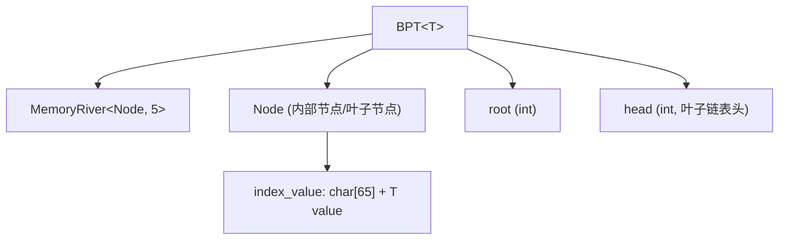
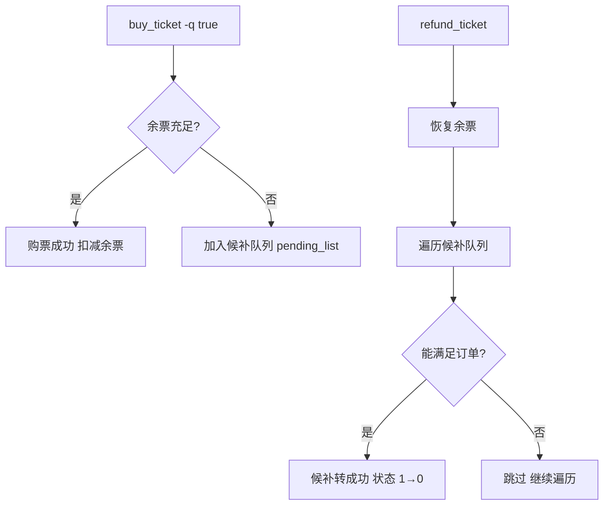

---

# Train Ticket Management System (火车票管理系统)

## 1. 项目概览

这是火车票管理系统的大作业，实现一个类似12306的火车票订票系统。项目分为两大部分：

**技术栈**：C++17。

**构建系统**：CMake (CMakeLists.txt)，编译产出为可执行文件 code。

## 2. 项目结构

```
Ticket-System-2026/
├── CMakeLists.txt              # CMake 构建配置
├── README.md                   # 项目说明
├── management_system.md        # 管理系统详细需求文档
├── bonus.md                    # Bonus 加分项说明
├── orders.txt                  # 开发用命令记录
│
├── include/                    # 头文件
│   ├── bpt.hpp                 # B+ 树 (核心数据结构)
│   ├── map.hpp                 # 自实现 map (AVL 树)
│   ├── vector.hpp              # 自实现 vector
│   ├── priority_queue.hpp      # 自实现优先队列 (左偏树)
│   ├── utility.hpp             # pair 模板
│   ├── exceptions.hpp          # 异常类
│   ├── time.hpp                # 时间工具函数
│   ├── train.hpp               # 列车数据结构 & TrainManager
│   ├── ticket.hpp              # 票据数据结构 & TicketManager
│   └── user.hpp                # 用户数据结构 & UserManager
│
├── src/                        # 源文件
│   ├── main.cpp                # 主入口，命令分发
│   ├── train.cpp               # 列车管理逻辑
│   ├── ticket.cpp              # 票据/订单管理逻辑
│   └── user.cpp                # 用户管理逻辑
│
├── B_plus_tree/                # 独立 B+ 树
│   ├── BPT                     # 编译产物
│   ├── BPT.cpp                 # B+ 树完整实现
│   └── shared_ptr.hpp          # shared_ptr 独立实现
│
├── testcases/                  # 测试用例 (1.in ~ 102.in)
│   ├── compare.cpp             # 输出比对工具
│   └── config.json             # 评测配置
│
└── build/                      # CMake 构建目录
```

## 3. 自实现的数据结构

### 3.1 B+ 树 (bpt.hpp)

整个系统的**核心存储引擎**，所有持久化数据都通过 B+ 树存储在磁盘上。



**关键设计**：

| 特性 | 说明 |
|------|------|
| 阶数 (ORDER) | 85 |
| 索引键 | 固定长度 `char[65]` 字符串 |
| 值类型 | 模板参数 `T` |
| 存储方式 | 基于 `MemoryRiver` 的二进制文件读写 |
| 叶子节点 | 通过 `next` 指针形成链表，支持范围查询 |
| 信息区 | 5 个 int 元信息槽 (root, head, 以及预留) |

**核心操作**：

- `init(filename)` — 初始化/打开 B+ 树文件
- `findinterval(pos, target, vec, num)` — 区间查找，返回所有匹配 index 的值
- `insert(index_value)` — 插入，含分裂 (`split`) 和借用 (`borrow`) 逻辑
- `remove(index_value)` — 删除，含合并逻辑
- `clean(filename)` — 清空

**分裂策略**：当节点元素数 > ORDER 时触发，中位点上移至父节点。

### 3.2 MemoryRiver (bpt.hpp)

磁盘 I/O 抽象层，封装二进制文件的读写：

```
MemoryRiver<T, info_len>
├── initialise()    — 创建/覆盖文件
├── open_existing() — 打开已有文件
├── write(T&)       — 追加写入，返回偏移量
├── update(T&, idx) — 按偏移量更新
├── read(T&, idx)   — 按偏移量读取
├── get_info()      — 读取元信息 (int)
└── write_info()    — 写入元信息 (int)
```

### 3.3 Map (map.hpp) — AVL 树

基于 **AVL 树** 实现，用于内存中的键值存储（如命令解析结果）。提供标准 map 接口：`find`, `insert`, `erase`, `[]` 运算符等。

### 3.4 Vector (vector.hpp)

类似 `std::vector` 的动态数组，支持随机访问迭代器、`push_back`, `pop_back`, `erase` 等。

### 3.5 Priority Queue (priority_queue.hpp) — 左偏树

基于 **左偏树 (Leftist Heap)** 实现的可并优先队列，用于 `query_ticket` 的结果排序。支持 `push`, `pop`, `top`, `merge`, `size`。

### 3.6 其他工具

| 文件 | 内容 |
|------|------|
| utility.hpp | `sjtu::pair<T1, T2>` 模板 |
| exceptions.hpp | 异常类 (`index_out_of_bound`, `runtime_error`, `invalid_iterator`, `container_is_empty`) |
| time.hpp | 时间/日期转换工具函数 |
| shared_ptr.hpp | 独立 `shared_ptr` 实现（引用计数） |

## 4. 核心业务模块

### 4.1 主入口 (main.cpp)

```
main()
├── 初始化 UserManager, TrainManager, TicketManager
├── 循环读取 [timestamp] command -key1 arg1 -key2 arg2 ...
├── 根据命令名分发到对应处理函数
└── 支持命令:
    add_user, login, logout, query_profile, modify_profile,
    add_train, delete_train, release_train, query_train,
    query_ticket, query_transfer, buy_ticket,
    query_order, refund_ticket, clean, exit
```

### 4.2 用户管理 (user.hpp + user.cpp)

```cpp
class UserManager {
    sjtu::vector<User> user_stack;  // 当前在线用户栈
    BPT<User> user_info;            // 持久化用户数据 (文件: username_user)
};
```

**User 结构体**：
- `username[21]` — 唯一标识，字母开头+字母数字下划线
- `password[31]` — 可见字符
- `name[16]` — 真实姓名，2~5 个 UTF-8 汉字
- `mail[31]` — 邮箱地址
- `privilege` — 权限等级 (0~10)

**功能**：注册（首个用户自动权限 10）、登录/登出（栈式管理在线状态）、查询/修改用户信息（权限控制）。

### 4.3 列车管理 (train.hpp + train.cpp)

```cpp
class TrainManager {
    BPT<TrainRef> id_train;          // trainID -> Train 文件偏移 (文件: id_Train)
    MemoryRiver<Train> train_data;  // Train 数据存储 (文件: train_data)
    BPT<route_to_id> route_id;      // "起点站+终点站" -> trainID 列表 (文件: route_id)
    BPT<station_to_id> station_id;  // 站名 -> trainID 列表 (文件: station_id)
};
```

**Train 结构体**（约 120KB/条）：
- 基本信息：`id`, `station_number`, `type`, `totoal_seat`
- 站点信息：`station_name[][]`, `price[]`（前缀和）, `left_ticket[][]`（多日余票矩阵）
- 时间信息：`arrival[]`, `departure[]`（以 base day 0 为基准的分钟偏移）
- 销售信息：`sale_start`, `sale_end`, `is_released`

**关键算法**：

- **`query_ticket`**：通过 `route_id` B+ 树快速定位候选列车 → 遍历检查日期合法性 → 按 `price` 或 `time` 排序输出（使用左偏树优先队列）
- **`query_transfer`**（换乘查询）：先找所有经过出发站的车次 → 枚举中转站 → 通过 `route_id` 查找第二程 → 按四关键字排序选最优解。使用 `TrainCache` 轻量结构体（~5KB）替代完整 `Train`（~120KB）来提升缓存命中率
- **`check_ticket_enough`**：区间余票检查（逐区间取最小值）
- **余票管理**：`successful_ticket_purchase` 和 `refund_ticket` 更新 `left_ticket[][]`

### 4.4 票据/订单管理 (ticket.hpp + ticket.cpp)

```cpp
class TicketManager {
    BPT<Ticket> id_ticket;                      // ticketID -> Ticket (文件: id_Ticket)
    BPT<trainid_time_to_id> trainid_time_id;    // 候补队列索引 (文件: pending_list)
    BPT<UserToId> user_id;                      // username -> ticketID 列表 (文件: username_trainid)
    int total_ticket_num;                       // 全局订单计数器 (文件: order_count)
};
```

**Ticket 结构体**：
- `ticket_id[11]` — 全局自增 ID
- `status` — `0`(success) / `1`(pending) / `2`(refunded)
- 订单信息：`train_id`, `start_station`, `end_station`, `departure_time`, `arrival_time`, `num`, `price`, `username`

**候补队列机制**：



- 候补队列按 `trainID + time_index` 分组索引
- 退票后按订单提交时间先后依次尝试满足候补订单
- 候补转正为**完整的订单单位**，不会拆分

## 5. 数据文件设计

系统在可执行文件目录创建的文件（共 9 个，不超过 50 个限制）：

| 文件名 | 存储内容 | B+ 树类型 |
|--------|----------|-----------|
| `username_user` | 用户账户数据 | `BPT<User>` |
| `id_Train` | 列车 ID → 文件偏移 | `BPT<TrainRef>` |
| `train_data` | 列车完整数据 | `MemoryRiver<Train>` |
| `route_id` | "起止站" → 列车 ID 列表 | `BPT<route_to_id>` |
| `station_id` | 站名 → 列车 ID 列表 | `BPT<station_to_id>` |
| `id_Ticket` | 订单 ID → 订单数据 | `BPT<Ticket>` |
| `pending_list` | 候补队列索引 | `BPT<trainid_time_to_id>` |
| `username_trainid` | 用户名 → 订单 ID 列表 | `BPT<UserToId>` |
| `order_count` | 全局订单计数 | `fstream` (单个 int) |

## 6. B+ 树独立实现 (B_plus_tree)

此目录包含独立的 B+ 树实现，用于提交到 OJ 题目 [3091](https://acm.sjtu.edu.cn/OnlineJudge/problem/3091)。与主项目中的 bpt.hpp 代码结构相同但独立维护，有自己的 shared_ptr.hpp。阶数同样为 85。

## 7. 时间与日期系统 (time.hpp)

```cpp
constexpr int DAY_MINUTE = 24 * 60;  // 1440 分钟

// 核心转换函数：
time_to_int("hh:mm")          // → 分钟数 (0-1439)
date_to_day_index("mm-dd")    // → 年内天数索引 (6月1日=1, 8月31日=92)
int_to_time(minutes)          // → "hh:mm"
day_index_to_day(index)       // → "mm-dd"
get_abs_time(total_minutes)   // → "mm-dd hh:mm" (绝对时间)
```

所有列车时间以**分钟**为单位，以 base day 0 为基准偏移，通过 `date_offset * DAY_MINUTE` 叠加日期。

---
